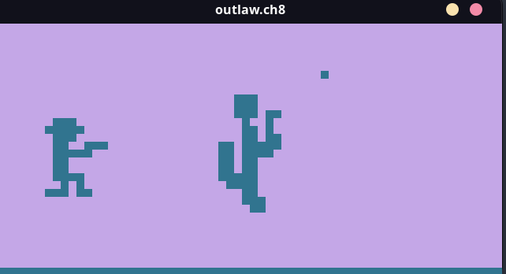

# CHIP-8
A Go implementation of a [CHIP-8 interpreter](https://www.wikiwand.com/en/CHIP-8).



Or as a TUI!


See more [demos here](#demos).
## Installation
Download the latest [release](https://github.com/braheezy/chip-8/releases) for your platform.

## Usage
Launch with your ROM:

    chip8 <chip-8 file>

Log instructions as they are processed (Warning! produces lots of messages):

    chip8 -debug <chip-8 file>

While the program passes all test ROMs from [Timendus' Test Suite](https://github.com/Timendus/chip8-test-suite), YMMV with random ROMs you pull from the Internet.

Here's the full usage:
```
Run CHIP-8 programs from the CLI with ease

Usage:
  chip8 <rom> [flags]
  chip8 [command]

Available Commands:
  help        Help about any command
  tui         Run in TUI mode

Flags:
  -c, --cosmac         Run in COSMAC VIP mode
  -d, --debug          Show debug messages
  -h, --help           help for chip8
      --list-modes     Show supported CHIP-8 variants
      --write-config   Write current config to default location. Existing config file will be overwritten!

Use "chip8 [command] --help" for more information about a command.
```

### Configuration
Various aspects of the interpreter can be tweaked in these ways, listed by precedence:
1. Setting the appropriate Environment Variable.
1. Creating a `config.toml` file in the same directory that `chip8` is being executed from

Running `chip8 --write-config` will (over)write all configuration options to a `config.toml`.

This table summarizes the existing configuration values and how to set them.

| Configuration | Default | TOML | Environment |
|---------------|---------|------|-------------|
| Change the display scale factor.<br>**1** uses the original 64x32 pixel display. | 10 | `display_scale_factor` | `CHIP8_DISPLAY_SCALE_FACTOR` |
| Delay the rate the interpreter processes instructions<br>**60** gives an execution rate of 60 Hz | 0 | `throttle_speed` | `CHIP8_THROTTLE_SPEED` |
| Stop execution after this many instructions are executed | 0 | `cycle_limit` | `CHIP8_CYCLE_LIMIT` |

### Run Modes and Quirks
Timendus provides this succinct description of what Quirks are:
> CHIP-8, SUPER-CHIP and XO-CHIP have subtle differences in the way they interpret the bytecode. We often call these differences quirks...This is one of the hardest parts to "get right" and often a reason why "some games work, but some don't".

All quirks belong to some other variation of CHIP-8. They can be set individually in `config.toml`. To use the different generations of CHIP-8, run with the appropriate flag set. This is equivalent to enabling all the quirks for that chipset:

    # Enable all COSMAC VIP quirks
    chip8 --cosmac <ROM>

#### COSMAC VIP ####
The following quirks are grouped under `cosmac-vip` section in the configuration file.

| Configuration Value | Description |
|---------------------|-------------|
| `reset_vf`          | The AND, OR and XOR opcodes (`8xy1`, `8xy2`, and `8xy3`) reset the flags register (`VF`) to zero
| `increment_i`       | Increment the memory index while `Fx55` and `Fx56` operate

You might also want to set `throttle_speed` to `60` if you're setting all these values for older games.

## Resources
- Introduction to the building blocks needed to write an interpreter for CHIP-8: [realemulator101's Introduction to CHIP-8](http://www.emulator101.com/introduction-to-chip-8.html)
- How to write the whole thing, but hints only. I used this the most ✨: [Tobias' Guide to making a CHIP-8 emulator](https://tobiasvl.github.io/blog/write-a-chip-8-emulator/)
- Quick instruction reference: [mattmikolay's CHIP‐8-Instruction-Set](https://github.com/mattmikolay/chip-8/wiki/CHIP%E2%80%908-Instruction-Set)
- More detailed reference: [Cowgod's Chip-8 Technical Reference](http://devernay.free.fr/hacks/chip8/C8TECH10.HTM)
- Test ROMs! Could not have built this without them ✨: [Timendus' CHIP-8 test suite](https://github.com/Timendus/chip8-test-suite)

When things got quirky:
- [CHIP-8 extensions and compatibility](https://chip-8.github.io/extensions/)
- [CHIP-8 Variant Opcode Table](https://chip8.gulrak.net/)

ROMs:
- [JohnEarnest's chip8Archive](https://johnearnest.github.io/chip8Archive/)

## Demos
